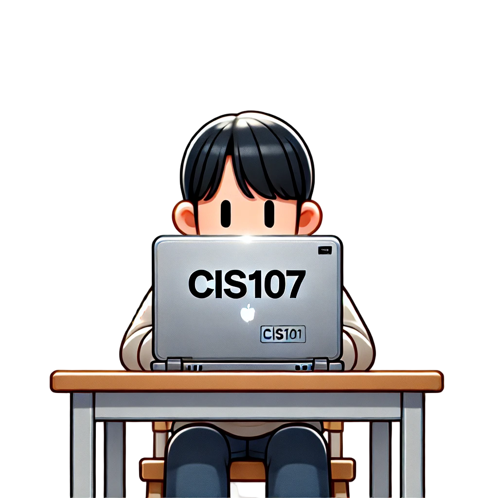

## Course Description

This course provides IT students with an introduction to information technology fundamentals encompassing both hardware and software. An emphasis is placed on the system unit components, peripheral devices, and systems and applications software. 

### Topics include:  
  * CPU
  * RAM
  * Machine cycle
  * Data representations
  * Number systems
  * Operating system characteristics
  * Utility programs
  * Language translators
  * Communication devices
  * Media
  * Computer networks. Students learn how to: effectively search the Internet for information, use Microsoft Windows, and use Microsoft productivity software (Word, Excel, and PowerPoint).

## Special Note
* If you have already completed CIS 101, you should not be registered for this course. Talk to your professor about it.
* This course is a pre-requisite for courses such as CIS 116, CIS 125, CIS 170, and CIS 180. Students who wish to take higher level courses need a “C” or better in this course to take those higher-level courses.
* For the laptop loan you need to send a request to the following email laptoploan@pccc.edu. Student ID, Name and School Email.
* Your instructor may also make available VDI, a tool that allows you to run Microsoft Windows & Office on any machine. If so, instructions will be found in Blackboard.
* Free Microsoft Office 2019/365 is available for students. See the link in Blackboard. This is available for Windows and Mac users.
* Tutoring and assistance with Microsoft & Windows projects can be found through the CIS Lab. More information here: [www.pccc.edu/cis/cis-lab](www.pccc.edu/cis/cis-lab)
  

| Instructor | Prerequisites         | Credits | Lecture Hours | Lab Room | Study time  |
| ---------- | --------------------- | ------- | ------------- | -------- | ----------- |
| R. Alberto | ENW-107 or DE-020/025 | 3       | 2.5           | H311     | **6 Hours** |

## Text Book Material

The online access code for an electronic book is included in your course registration. 

## Additional Time and Supplemental Requirements
* Study time out of class is about six (6) hours per week.
* Read the text chapters assigned per the schedule.
* Review objectives from the chapters.
* Work on some exercises at the end of the chapter.

## Course Learning Outcomes:
Upon completion of this course, students will be able to:
1. Describe the different data types and computer operations on each type
2. Explain the functions of computing hardware components
3. Distinguish between hardware and software
4. Distinguish between system software and application software.
5. Demonstrate understanding new technology trends.
6. Convert a given number from one base to other bases
7. Apply system (Windows) and application software (Word, Excel, PowerPoint) to accomplish tasks
8. Utilize search engines to find information on the Web

## Grading Standards

| Component                     | Percentage | Other                     |
| ----------------------------- | ---------- | ------------------------- |
| Exams                         | 30%        | 5 - 7 test will be given  |
| Projects, Activities, Quizzes | 30%        | Via MyITLab               |
| Discussion Boards,            | 10%        | One Per chapter           |
| Web Design Project            | 10%        | Wix.com                   |
| Class Notes                   | 10%        | Chapter notes from TIA    |
| Attendance & participation    | 10%        | Participation assignments |